# Тема 1 Введение в Python
Отчет по теме 1 выполнил:
 - Сартаков Василий Александрович
 - ИВТ-22-2

| Задание | Выполнение |
| ------- | ---------- |
| Задание 1 | + |
| Задание 2 | + |
| Задание 3 | + |
| Задание 4 | + |
| Задание 5 | + |
| Задание 6 | + |
| Задание 7 | + |
| Задание 8 | + |
| Задание 9 | + |
| Задание 10 | + |
| Задание 11 | + |
| Задание 12 | + |
| Задание 13 | + |
| Задание 14 | + |
| Задание 15 | + |

знак "+" - задание выполнено; знак "-" - задание не выполнено;

Работу проверили:
- к.э.н., доцент Панов М.А.

## Задание №1
### Установка

### Результат.
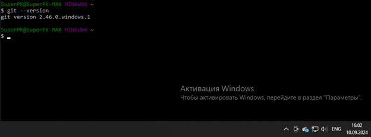

## Выводы
1. Установка git на Windows производится за счёт инсталятора, скачаного с официального сайта
2. Во время установки предлагается гибкая настройка для удобства пользователя

## Задание №2
### Настройка

### Результат.
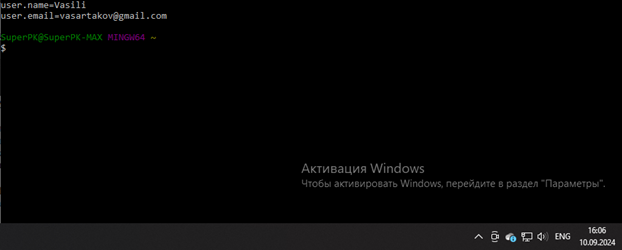

## Выводы
1. Настройка git производиться через команды ```git config "..."```
2. Проверить настройки git можно через команду ```git config --list```
3. Для работы, git`у нужны установленные значения имени и почты

## Задание №3
### Создание нового репозитория

### Результат.
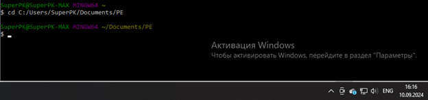
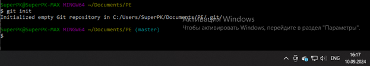

## Выводы
1. Инициализация git происходит при помощи команды ```git init```

## Задание №4
### Подготовка файлов

### Результат.
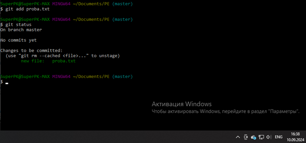

## Выводы
1. Добавили файл в репозиторий происходит благодаря команде ```git add "..."```

## Задание №5
### Фиксация изменений  

### Результат.
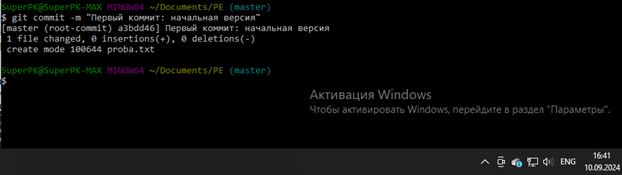
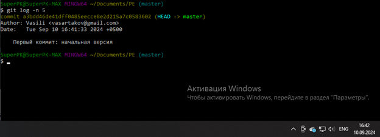

## Выводы
1. Создать комит можно при помощи ```git commit -m "commit_name"```. Флаг -m обозначает message, используется для быстрого установки сообщения коммита. Без флага откроется внутренний редактор, например vim или nano, в котором также мы сможем указать о чём наш комит.
2. Просмотреть существующие коммиты можно командой ```git log```.

## Задание №6
### Подключение к удаленному репозиторию

### Результат.
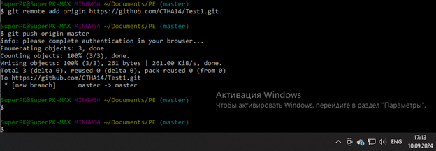
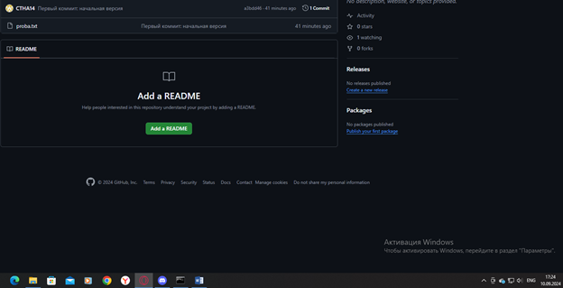
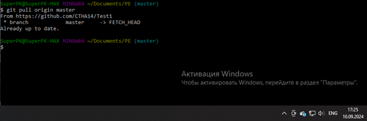


## Выводы
1. Подключение к репозиторию осуществляется через команду ```git remote add <remote_rep_name> <remote_rep_url>```
2. Чтобы опубликовать свои коммиты, используем команду ```git push <remote_rep_name> <branch_name>```
3. Для того чтобы получить коммиты используем команду ```git pull <remote_rep_name> <branch_name>```
4. Для временного сохранения изменений используется команда ```git stash```

## Задание №7
### Ветвление

### Результат.
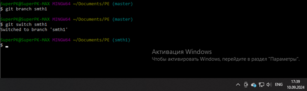
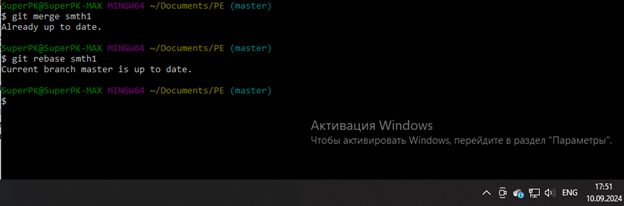

## Выводы
1. Посмотреть достпуные ветки и определить текущую ветку можно используя команду ```git branch```
2. Создание новой ветки производиться через команду ```git branch <branch_name>```
3. Переключиться на другую ветку ```git switch <branch_name>```
4. Слияние ветвей производится командой ```git merge```

## Задание №8
### Особенности применения «Фетч»

### Результат.


## Выводы
1. fetch синхронизирует локальный репозиторий с удалённым, однако не производит автоматического слияния новых комитов из удалённого репозитория и ваших из локального.

## Задание №9
### Удаление файлов, веток, локальных и удалённых репозиториев

### Результат.
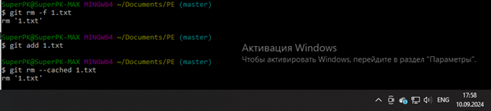
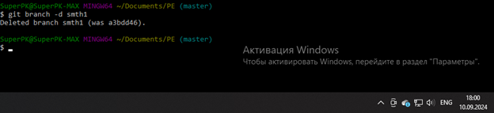
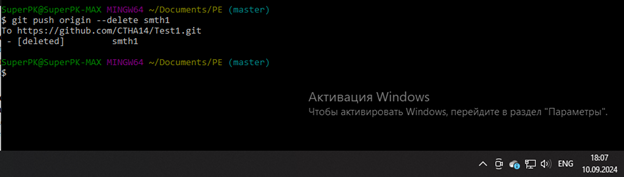
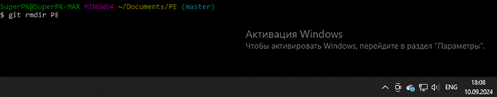
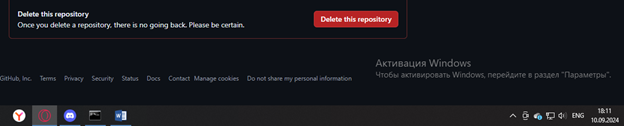

## Выводы
1. Удаление ветки можно сделать через команду ```git branch -d <branch_name>```. Флаг d обозначает слово delete.
2. Удаление ветки в удалённом репозитории ```git push origin --delete <branch_name>```
3. Удаление файлов из index и из рабочей директории ```git rm <file_name>```
4. Удаление файлов из index ```git rm --cached <file_name>```

## Задание №10
### Отслеживание изменений в коммитах

### Результат.
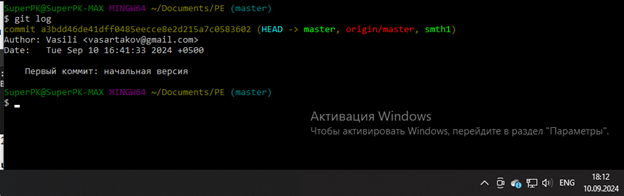
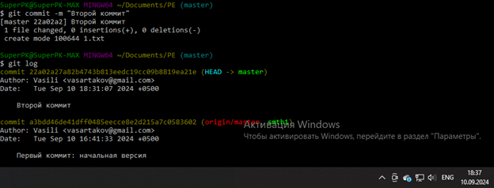

## Выводы
1. Отслеживать историю изменений можно через ```git log```
2. Можно сравнивать комиты через команду ```git diff <branch_1> <branch_2>```

## Задание №11
### Возвращение файла к предыдущему состоянию

### Результат.
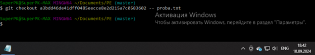

## Выводы
1. Хэш коммита можно узнать через команду ```git log```
2. Вернуть файл к определённому состоянию можно командой ```git checkout <commit_hash> --<file_path>```

## Задание №12
###  Возвращение к предыдущему коммиту  

### Результат.
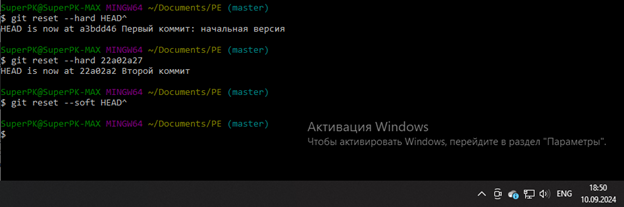

## Выводы
1. Переход на страый комит осуществляется через ```git checkout <commit_hash>```

## Задание №13
###  Исправление коммита  

### Результат.
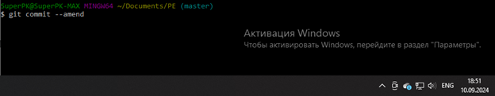
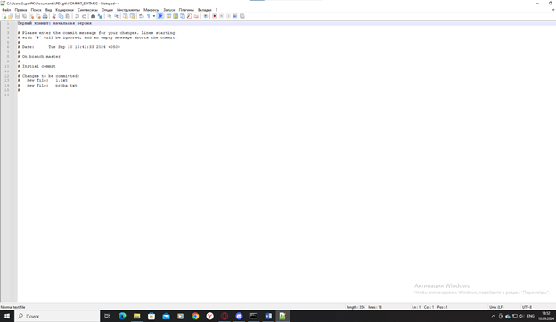

## Выводы
1. Исправление коммита происходит через ```git commit --amend```

## Задание №14
### Разрешение конфликтов при слиянии

### Результат.
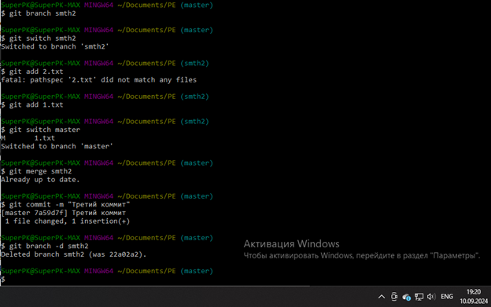

## Выводы
1. Скрещение двух веток можно сделать через ```git merge <branch_name>```
2. Если возникают конфликты, то выведится лог с именами файлов, в которых есть конфликты.

## Задание №15
### Настройка .gitignore

### Результат.
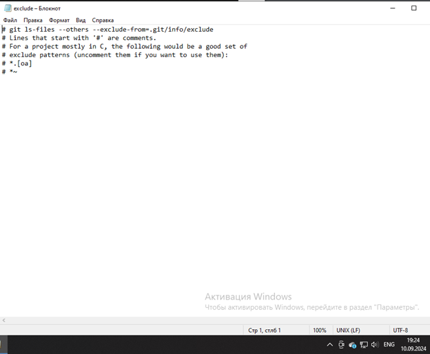

## Выводы
1. Файл gitignore содержит в себе перечень файлов,которые не стоит учитывать


