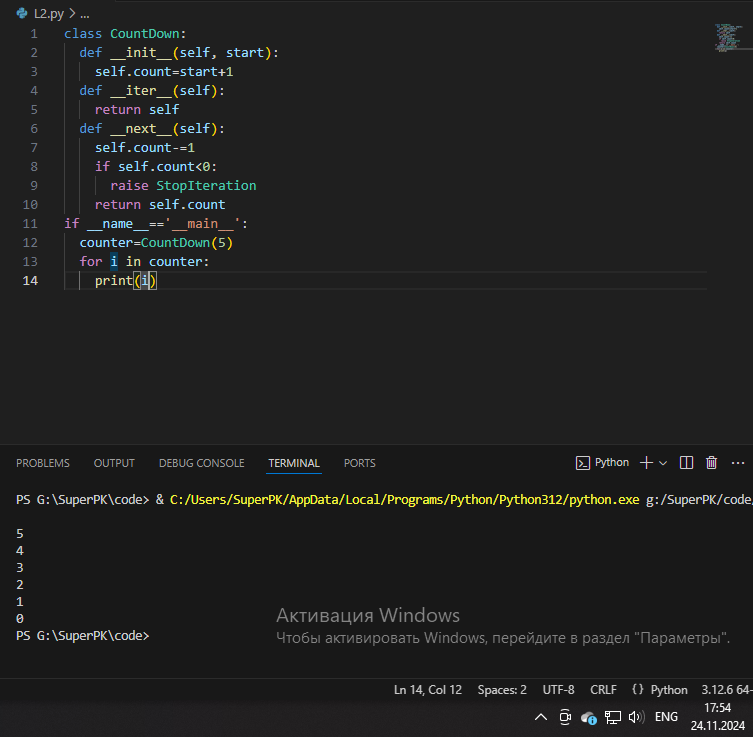
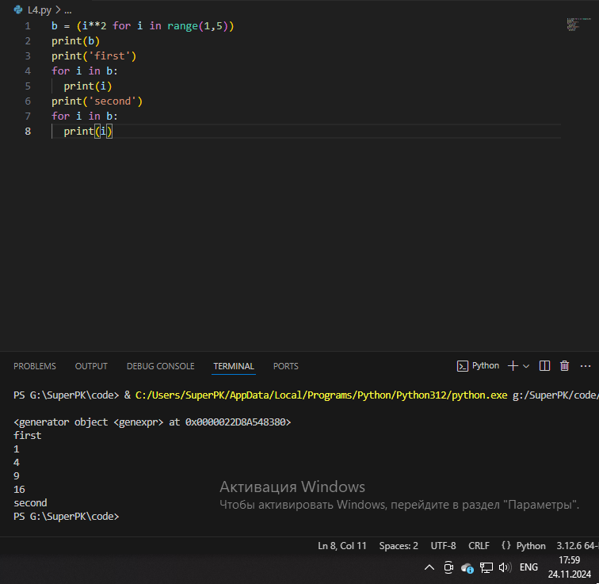

# Тема 10. Концепции и принципы ООП 
Отчет по Теме #10 выполнил:
- Сартаков Василий Александрович
- ИВТ-22-2

| Задание | Лаб_раб | Сам_раб |
| ------ | ------ | ------ |
| Задание 1 | + | + |
| Задание 2 | + | + |
| Задание 3 | + | + |
| Задание 4 | + | + |
| Задание 5 | + | + |

знак "+" - задание выполнено; знак "-" - задание не выполнено;

Работу проверили:
- к.э.н., доцент Панов М.А.

## Лабораторная работа №1
### Наверняка вы думаете, что декораторы – это какая-то бесполезная вещь, которая вам никогда не пригодится, но тут вдруг на паре по математике преподаватель просит всех посчитать число Фибоначчи для 100. Кто-то будет считать вручную (так точно не нужно), кто-то посчитает на калькуляторе, а кто-то подумает, что он самый крутой и напишет рекурсивную программу на Python и немного огорчится, потому что данная программа будет достаточно долго считаться, если ее просто так запускать. Но именно тут к вам на помощь приходят декораторы, например @lru_cache (он предназначен для решения задач динамическим программированием, если простыми словами, то этот декоратор запоминает промежуточные результаты и при рекурсивном вызове функции программа не будет считать одни и те же значения, а просто “возьмёт их из этого декоратора”). Вам нужно написать программу, которая будет считать числа Фибоначчи для 100 и запустить ее без этого декоратора и с ним, посмотреть на разницу во времени решения поставленной задачи. P.S. при запуске без декоратора можете долго не ждать, для наглядности хватит 10 секунд ожидания.

```python
from functools import lru_cache

@lru_cache(maxsize=128)
def fibonacci(n):
  if n == 0:
    return n
  elif n == 1:
    return 1
  return fibonacci(n - 1) + fibonacci(n - 2)

if __name__ == "__main__":
  print(fibonacci(100))
```

### Результат.


## Лабораторная работа №2
### Илья пишет свой сайт и ему необходимо сделать минимальную проверку ввода данных пользователя при регистрации. Для этого он реализовал функцию, которая выводит данные пользователя на экран и решил, что будет проверять правильность введённых данных при помощи декоратора, но в этом ему потребовалась ваша помощь. Напишите декоратор для функции, который будет принимать все параметры вызываемой функции (имя, возраст) и проверять чтобы возраст был больше 0 и меньше 130. Причем заметьте, что неважно сколько пользователь введет данных на сайт к Илье, будут обрабатываться только первые 2 аргумента


```python
def check(input_func):
  def output_func(*args):
    name, age = args[0], args[1]

    if age < 0 or age > 130:
      age = 'Неккоректный возраст'
    
    return input_func(name, age)

  return output_func

  
@check 
def personal_info(name, age):
  print(f"Имя: {name}, Возраст: {age}")


if __name__ == '__main__':
  personal_info('Владимир', -5)
  personal_info('Владислав', 20)
  personal_info('Анастасия', 139, 1, 51)
```

### Результат.


## Лабораторная работа №3
### Вам понравилась идея Ильи с сайтом, и вы решили дальше работать вместе с ним. Но вот в вашем проекте появилась проблема, кто-то пытается сломать вашу функцию с получением данных для сайта. Эта функция работает только с данными integer, а какой-то недохакер пытается все сломать и вместо нужного типа данных отправляет string. Воспользуйтесь исключениями, чтобы неподходящий тип данных не ломал ваш сайт. Также дополнительно можете обернуть весь код функции в try/except/finally для того, чтобы программа вас оповестила о том, что выявлена какая-то ошибка или программа успешно выполнена

```python
def data(*args):
  try: 
    for i in range(len(args[0])):
      try:
        result = (args[0][i] * 15) // 10
        print(result)
      except Exception as ex:
        print(ex)
  except Exception as ex:
    print(ex)
  finally:
    print('Всё обработано')

data([25, 18, 'Your', 'computer', 'has', 'virus', 2, 15])
```

### Результат.


## Лабораторная работа №4
### Продолжая работу над сайтом, вы решили написать собственное исключение, которое будет вызываться в случае, если в функцию проверки имени при регистрации передана строка длиннее десяти символов, а если имя имеет допустимую длину, то в консоль выводиться “Успешная регистрация”


```python 
class NegativeValueException(Exception):
  pass

def check_name(name):
  if len(name) > 10:
    raise NegativeValueException('Длина более 10 символов')
  else:
    print('Успешная регестрация')

if __name__=='__main__':
  name='12345678910'
  check_name(name)
```

### Результат.


## Лабораторная работа №5
### После запуска сайта вы поняли, что вам необходимо добавить логгер, для отслеживания его работы. Готовыми вариантами вы не захотели пользоваться, и поэтому решили создать очень простую пародию. Для этого создали две функции: init() (вызывается при создании класса декоратора в программе) и call() (вызывается при вызове декоратора). Создайте необходимый вам декоратор. Выведите все логи в консоль.

```python
class SiteChecker:
  def __init__(self, func):
    print('> Класс SiteChecker метод __init__ запущен')
    self.func = func

  
  def __call__(self):
    print('> Проверка', self.func.__name__)
    self.func()
    print('> Проверка')


@SiteChecker
def site():
  print('Работа сайта')

if __name__=='__main__':
  print('>> Сайт запущен')
  site()
  print('>> Саёт выключен')
```

### Результат.


## Самостоятельная работа
### Задания для самостоятельного выполнения:
Задание Садовник и помидоры.
Классовая структура:
Есть Помидор со следующими характеристиками:
•	Индекс
•	Стадия созревания (стадии: отсутствует, цветение, зеленый, красный)
Помидор может:
•	Расти (переходить на следующую стадию созревания)
•	Предоставлять информацию о своей зрелости

Есть Куст с помидорами, который:
•	Содержит список томатов, которые на нем растут А также может:
•	Расти вместе с томатами
•	Предоставлять информацию о зрелости всех томатов
•	Предоставлять урожай
И также есть Садовник, который имеет:
•	Имя
•	Растение, за которым он ухаживает Он может:
•	Ухаживать за растением
•	Собирать с него урожай

## Самостоятельная работа №1
### Вызовите справку по садоводству

```python
class Tomato:
    
    states = {'Отсутствует': 0, 'Цветение': 1, 'Зеленый': 2, 'Красный': 3}
    
    def __init__(self, index):
        self._index = index
        self._state = self.states['Отсутствует']
        
    def grow(self):
        if self._state < 3:
            self._state += 1
        
    def is_ripe(self):
        return True if self._state == 3 else False
 
class TomatoBush:
    
    def __init__(self, num):
        self.tomatoes = [Tomato(index) for index in range(1, num+1)]
        
    def grow_all(self):
        for tomato in self.tomatoes:
            tomato.grow()
            
    def all_are_ripe(self):
        return all([tomato.is_ripe() for tomato in self.tomatoes])
    
    def give_away_all(self):
        self.tomatoes = []
 
class Gardener:
    
    def __init__(self, name, plant):
        self.name = name
        self._plant = plant
        
    def work(self):
        self._plant.grow_all()
        
    def harvest(self):
        if self._plant.all_are_ripe():
            print('Урожай собран!')
            self._plant.give_away_all()
        else:
            print('Томаты еще не дозрели')
            
    @staticmethod
    def knowledge_base():
        print('Справка по садоводству:')
        print('1. Не забывайте регулярно поливать и подкармливать растения')
        print('2. Определите правильное расстояние между растениями, чтобы они не мешали друг другу в росте')
        print('3. Удалите поврежденные листья и плоды, чтобы предотвратить распространение болезней')
 
Gardener.knowledge_base()
```

### Результат.


## Выводы
1. В Python для создания статических классов используется команда ```@staticmethod```

## Самостоятельная работа №2
### Создайте объекты классов TomatoBush и Gardener

```python
class Tomato:
    
    states = {'Отсутствует': 0, 'Цветение': 1, 'Зеленый': 2, 'Красный': 3}
    
    def __init__(self, index):
        self._index = index
        self._state = self.states['Отсутствует']
        
    def grow(self):
        if self._state < 3:
            self._state += 1
        
    def is_ripe(self):
        return True if self._state == 3 else False
 
class TomatoBush:
    
    def __init__(self, num):
        self.tomatoes = [Tomato(index) for index in range(1, num+1)]
        
    def grow_all(self):
        for tomato in self.tomatoes:
            tomato.grow()
            
    def all_are_ripe(self):
        return all([tomato.is_ripe() for tomato in self.tomatoes])
    
    def give_away_all(self):
        self.tomatoes = []
 
class Gardener:
    
    def __init__(self, name, plant):
        self.name = name
        self._plant = plant
        
    def work(self):
        self._plant.grow_all()
        
    def harvest(self):
        if self._plant.all_are_ripe():
            print('Урожай собран!')
            self._plant.give_away_all()
        else:
            print('Томаты еще не дозрели')
            
    @staticmethod
    def knowledge_base():
        print('Справка по садоводству:')
        print('1. Не забывайте регулярно поливать и подкармливать растения')
        print('2. Определите правильное расстояние между растениями, чтобы они не мешали друг другу в росте')
        print('3. Удалите поврежденные листья и плоды, чтобы предотвратить распространение болезней')
 
bush = TomatoBush(5)
gardener = Gardener('John', bush)
```

### Результат.


## Выводы
1. На данном этапе мы создаём экземпляры классов, олицетворяющие собой помидорный куст и садовника.

## Самостоятельная работа №3
### Используя объект класса Gardener, поухаживайте за кустом с помидорами

```python
class Tomato:
    
    states = {'Отсутствует': 0, 'Цветение': 1, 'Зеленый': 2, 'Красный': 3}
    
    def __init__(self, index):
        self._index = index
        self._state = self.states['Отсутствует']
        
    def grow(self):
        if self._state < 3:
            self._state += 1
        
    def is_ripe(self):
        return True if self._state == 3 else False
 
class TomatoBush:
    
    def __init__(self, num):
        self.tomatoes = [Tomato(index) for index in range(1, num+1)]
        
    def grow_all(self):
        for tomato in self.tomatoes:
            tomato.grow()
            
    def all_are_ripe(self):
        return all([tomato.is_ripe() for tomato in self.tomatoes])
    
    def give_away_all(self):
        self.tomatoes = []
 
class Gardener:
    
    def __init__(self, name, plant):
        self.name = name
        self._plant = plant
        
    def work(self):
        self._plant.grow_all()
        
    def harvest(self):
        if self._plant.all_are_ripe():
            print('Урожай собран!')
            self._plant.give_away_all()
        else:
            print('Томаты еще не дозрели')
            
    @staticmethod
    def knowledge_base():
        print('Справка по садоводству:')
        print('1. Не забывайте регулярно поливать и подкармливать растения')
        print('2. Определите правильное расстояние между растениями, чтобы они не мешали друг другу в росте')
        print('3. Удалите поврежденные листья и плоды, чтобы предотвратить распространение болезней')
 
bush = TomatoBush(5)
gardener = Gardener('John', bush)
 
gardener.work()
gardener.work()
gardener.work()
```

### Результат.


## Выводы
1. Метод ```work``` позволяет менять состояние помидор с менее зрелого, на более зрелое

## Самостоятельная работа №4
### Попробуйте собрать урожай, когда томаты еще не дозрели. Продолжайте ухаживать за ними

```python
class Tomato:
    
    states = {'Отсутствует': 0, 'Цветение': 1, 'Зеленый': 2, 'Красный': 3}
    
    def __init__(self, index):
        self._index = index
        self._state = self.states['Отсутствует']
        
    def grow(self):
        if self._state < 3:
            self._state += 1
        
    def is_ripe(self):
        return True if self._state == 3 else False
 
class TomatoBush:
    
    def __init__(self, num):
        self.tomatoes = [Tomato(index) for index in range(1, num+1)]
        
    def grow_all(self):
        for tomato in self.tomatoes:
            tomato.grow()
            
    def all_are_ripe(self):
        return all([tomato.is_ripe() for tomato in self.tomatoes])
    
    def give_away_all(self):
        self.tomatoes = []
 
class Gardener:
    
    def __init__(self, name, plant):
        self.name = name
        self._plant = plant
        
    def work(self):
        self._plant.grow_all()
        
    def harvest(self):
        if self._plant.all_are_ripe():
            print('Урожай собран!')
            self._plant.give_away_all()
        else:
            print('Томаты еще не дозрели')
            
    @staticmethod
    def knowledge_base():
        print('Справка по садоводству:')
        print('1. Не забывайте регулярно поливать и подкармливать растения')
        print('2. Определите правильное расстояние между растениями, чтобы они не мешали друг другу в росте')
        print('3. Удалите поврежденные листья и плоды, чтобы предотвратить распространение болезней')
 
bush = TomatoBush(5)
gardener = Gardener('John', bush)
 
gardener.work()

gardener.harvest()
```

### Результат.


## Выводы
1. При недостаточном уровне зрелости плодов программа не позволит собрать урожай

## Самостоятельная работа №5
### Соберите урожай

```python
class Tomato:
    
    states = {'Отсутствует': 0, 'Цветение': 1, 'Зеленый': 2, 'Красный': 3}
    
    def __init__(self, index):
        self._index = index
        self._state = self.states['Отсутствует']
        
    def grow(self):
        if self._state < 3:
            self._state += 1
        
    def is_ripe(self):
        return True if self._state == 3 else False
 
class TomatoBush:
    
    def __init__(self, num):
        self.tomatoes = [Tomato(index) for index in range(1, num+1)]
        
    def grow_all(self):
        for tomato in self.tomatoes:
            tomato.grow()
            
    def all_are_ripe(self):
        return all([tomato.is_ripe() for tomato in self.tomatoes])
    
    def give_away_all(self):
        self.tomatoes = []
 
class Gardener:
    
    def __init__(self, name, plant):
        self.name = name
        self._plant = plant
        
    def work(self):
        self._plant.grow_all()
        
    def harvest(self):
        if self._plant.all_are_ripe():
            print('Урожай собран!')
            self._plant.give_away_all()
        else:
            print('Томаты еще не дозрели')
            
    @staticmethod
    def knowledge_base():
        print('Справка по садоводству:')
        print('1. Не забывайте регулярно поливать и подкармливать растения')
        print('2. Определите правильное расстояние между растениями, чтобы они не мешали друг другу в росте')
        print('3. Удалите поврежденные листья и плоды, чтобы предотвратить распространение болезней')
 
bush = TomatoBush(5)
gardener = Gardener('John', bush)
 
gardener.work()
gardener.work()
gardener.work()

gardener.harvest()
```

### Результат.


## Выводы
1. Метод ```harvest``` позволяет собрать урожай
