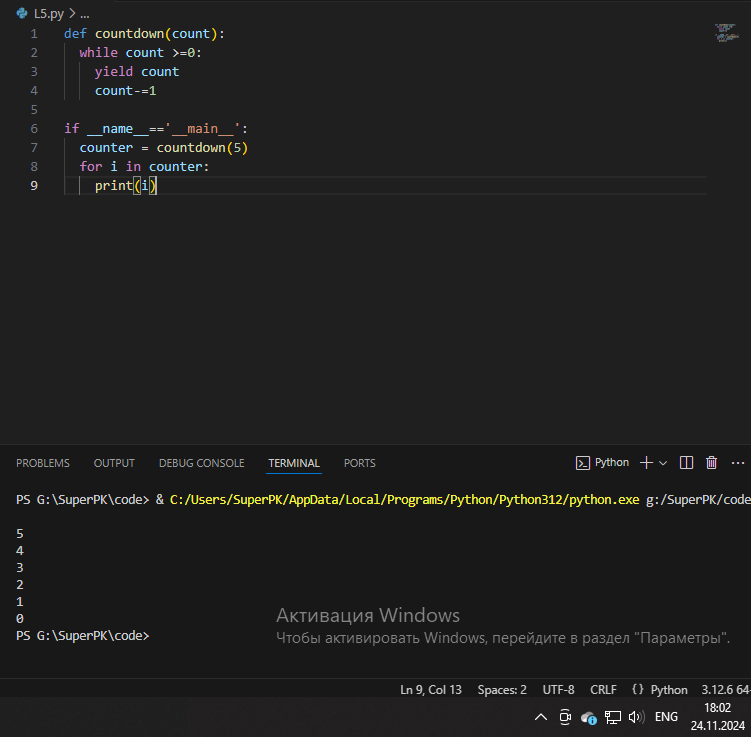
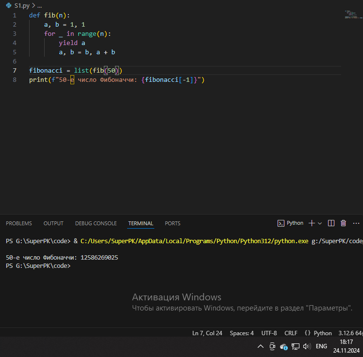

# Тема 2. Базовые операции языка Python
Отчет по Теме #2 выполнил:
- Сартаков Василий Александрович
- ИВТ-22-2

| Задание | Лаб_раб | Сам_раб |
| ------ | ------ | ------ |
| Задание 1 | + | + |
| Задание 2 | + | + |
| Задание 3 | + | + |
| Задание 4 | + | + |
| Задание 5 | + | + |
| Задание 6 | + | + |
| Задание 7 | + | + |
| Задание 8 | + | + |
| Задание 9 | + | + |
| Задание 10 | + | + |

знак "+" - задание выполнено; знак "-" - задание не выполнено;

Работу проверили:
- к.э.н., доцент Панов М.А.

## Лабораторная работа №1
### Выведите в консоль три строки. Первая – любое число. Вторая – любое число в виде строки. Третья – любое число с плавающей точкой.

```python
print(123)
print("2134")
print(1.25)
```

### Результат.


## Выводы
1. Функия print выводит значение в консоль и преобразует данные в строку

## Лабораторная работа №2
### Выведите в консоль три строки. Первая – результат сложения или вычитания минимум двух переменных типа int. Вторая – результат сложения или вычитания минимум двух переменных типа float. Третья – результат сложения или вычитания минимум двух переменных типа int и float.

```python
print(2+2)
print(2.5 - 3.2)
print(2.5 + 4)
```

### Результат.


## Выводы
1. Так как python имеет динамическую типизацию и в большенстве случаев он сам реашает какой тип присвоить переменной, то в случае смешивания двух типов float и int он автоматически переводит int переменную к float и в итоге результат с типом float.
2. Во второй строке(второй print) получилось значение -0.7000000000000002. Такое происходит из-за формата хранения чисел с плавающей точкой IEEE754, который не может точно предствить некоторые десятичные дроби.  

## Лабораторная работа №3
### Выведите в консоль три строки. Первая – обычная строка. Вторая – F строка с использованием заранее объявленной переменной. Третья – сложите две или более строк в одну.

```python
print("Hello, world!")
Guys = "Guys"
print(f"Hello, {Guys}")
a = "Hello, "
b = "world!"
print(a + b)
```

### Результат.


## Выводы
1. Сложение строк в python осуществляется при помощи знака '+'
2. Использования перменных в строке осуществляется при помощи конструкции f"Your text {variable}"

## Лабораторная работа №4
### Выведите в консоль три строки. Первая – трансформация любого типа переменной в bool. Вторая – трансформация любого типа переменной в float или int. Третья – трансформация любого типа переменной в str.

```python 
v8 = "Wrrrrrr"
print(bool(v8))

v10 = 16273849510
print(float(v10))

v12 = None
print(str(v12))
```

### Результат.


## Выводы
1. В bool можно преобразовать перменную любого типа
2. Преобразовать в int или float можно число float или int, строку с числами и bool переменные 
3. В строку можно преобразовать всё

## Лабораторная работа №5
### Присвойте трем переменным различные значения, воспользовавшись функцией input()

```python
v8 = input("one: ")
v10 = input("two: ")
v12 = input("three: ")
print(v8, v10, v12)
```

### Результат.


## Выводы
1. input считывает данные как строки
2. input позволяет ввести значение переменной через консоль

## Лабораторная работа №6
### Создайте две любые числовые переменные и выполните над ними несколько математических операций: возведение в степень, обычное деление, целочисленное деление, нахождение остатка от деления. При желании вы можете проверить как работают эти вычисления с разными типами данных, например, сначала создать две переменные int, затем создать две переменные float и наконец создать переменные типа int и float и провести над ними операции, прописанные выше.

```python
a=12
b=21
print(a**b)
print(a/b)
print(a//b)
print(a%b)
```

### Результат.


## Выводы
1. Операторы python работают как с целыми числами, так и с плавающими числами

## Лабораторная работа №7
### Создайте любую строковую переменную и произведите над ней математическое действие умножение на любое число.

```python
str = "Wrum"
print(str*7)
```

### Результат.


## Выводы
1. Умножение строки на число в python приводит к дублированию строки столько раз, сколько мы указали.

## Лабораторная работа №8
### Посчитайте сколько раз символ ‘o’ встречается в строке ‘Hello World’.

```python 
word = "Hello World!"
print(word.count('o'))
``` 

### Результат.


## Выводы
1. При помощи функции count, мы можем считать определённые символы из строки string

## Лабораторная работа №9
### Напишите предложение ‘Hello World’ в две строки. Написанная программа должна занимать одну строку в редакторе кода

```python
print("Hello\nWorld")
```

### Результат.


## Выводы
1. python автоматически преобразует строковые литералы

## Лабораторная работа №10
### Из предложения ‘Hello World’ выведите в консоль только 2 символ, а затем выведите слово ‘Hello’

```python
word = "Hello world!"
print(word[1])
print(word[:5])
```

### Результат.


## Выводы
1. python позволяет обращаться к отдельным элементам строки, а также изменять их

## Самостоятельная работа №1
### Выведите в консоль булевую переменную False, не используя слово False в строке или изначально присвоенную булевую переменную. Программа должна занимать не более двух строк редактора кода.

```python
print(bool(None))
```

### Результат.


## Выводы
1. Преобразовав переменную в None, мы получаем значение False не используя слово False.

## Самостоятельная работа №2
### Присвоить значения трем переменным и вывести их в консоль, используя только две строки редактора кода

```python
a, b, c = "string", "string 1", "str"
print(a, c, b)
```

### Результат.


## Выводы
1. В python можно инициализировать несколько переменных в одной строке

## Самостоятельная работа №3
### Реализуйте ввод данных в программу, через консоль, в виде только целых чисел (тип данных int). То есть при вводе буквенных символов в консоль, программа не должна работать. Программа должна занимать не более двух строк редактора кода.

```python
i = int(input())
print(i)
```

### Результат.


## Выводы
1. данные из input можно сразу преобразовать в int тип 

## Самостоятельная работа №4
### Создайте только одну строковую переменную. Длина строки должна не превышать 5 символов. На выходе мы должны получить строку длиной не менее 16 символов. Программа должна занимать не более двух строк редактора кода.

```python
result = 'S4 Qattro ' * 4
print(result)
```

### Результат.


## Выводы
1. Умножая строку на число, мы получаем дублирование этой строки на n раз

## Самостоятельная работа №5
### Создайте три переменные: день (тип данных - числовой), месяц (тип данных - строка), год (тип данных - числовой) и выведите в консоль текущую дату в формате: “Сегодня день месяц год. Всего хорошего!” используя F строку и оператор end внутри print(), в котором вы должны написать фразу “Всего хорошего!”. Программа должна занимать не более двух строк редактора кода.

```python
d, m, y = 17, "сентября", 2024
print(f"Сегодня {d} {m} {y}. ", end="Всего хорошего!\n")
```

### Результат.


## Выводы
1. параметр end у метода print устанвавливает то, чем должен быть закончен вывод

## Самостоятельная работа №6
### В предложении ‘Hello World’ вставьте ‘my’ между двумя словами. Выведите полученное предложение в консоль в одну строку. Программа должна занимать не более двух строк редактора кода.

```python
string = "Hello world"
print(f"{string[:5]} my {string[6:]}")
```

### Результат.


## Выводы
1. При помощи слайсов, можно дополнить строку в python

## Самостоятельная работа №7
### Узнайте длину предложения ‘Hello World’, результат выведите в консоль. Программа должна занимать не более двух строк редактора кода

```python
string = "Hello world"
print(len(string))
```

### Результат.


## Выводы
1. Функция len выводит длину строки

## Самостоятельная работа №8
### Переведите предложение ‘HELLO WORLD’ в нижний регистр. Программа должна занимать не более двух строк редактора кода

```python
string = "HELLO WORLD"
print(string.lower())
```

### Результат.


## Выводы
1. Функция lower приводит все символы в нижний регистр

## Самостоятельная работа №9
### Самостоятельно придумайте задачу по проходимой теме и решите ее. Задача должна быть связанна со взаимодействием с числовыми значениями.

### Реализация теоремы пифагора. Результат округлить до двух знаков
```python
a = 2
b = 3
c = pow(a**2 + b**2, 2)
print(c)
```

### Результат.


## Выводы
1. В python функция pow выполняет ту же задачу, что и оператор **

## Самостоятельная работа №10
### Самостоятельно придумайте задачу по проходимой теме и решите ее. Задача должна быть связанна со взаимодействием со строковыми значениями

### Дополнить строк словом my и указать начальный размер строки

```python
str = "Software engineering"
print(len(str))
```

### Результат.


## Выводы
1. Функция len позволяет узнать длину строки

