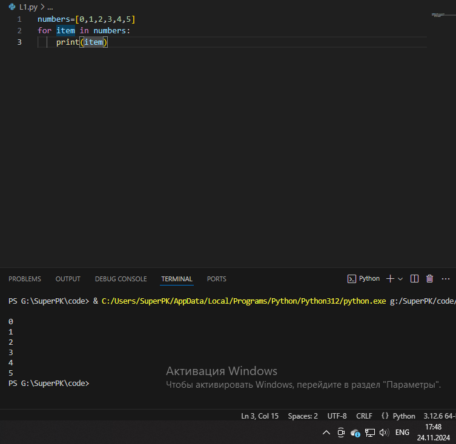
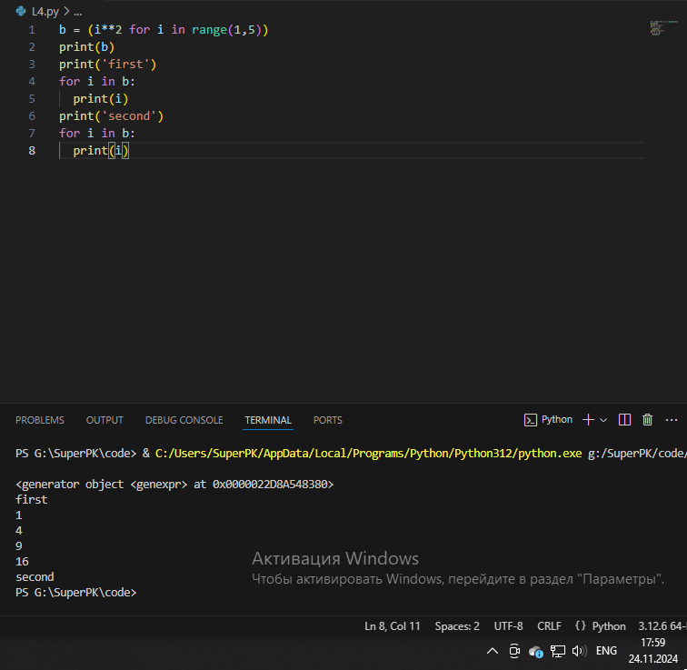

# Тема 5. Базовые коллекции: строки и списки
Отчет по Теме #5 выполнил:
- Сартаков Василий Александрович
- ИВТ-22-2

| Задание | Лаб_раб | Сам_раб |
| ------ | ------ | ------ |
| Задание 1 | + | + |
| Задание 2 | + | + |
| Задание 3 | + | + |
| Задание 4 | + | + |
| Задание 5 | + | + |
| Задание 6 | + | - |
| Задание 7 | + | - |
| Задание 8 | + | - |
| Задание 9 | + | - |
| Задание 10 | + | - |

знак "+" - задание выполнено; знак "-" - задание не выполнено;

Работу проверили:
- к.э.н., доцент Панов М.А.

## Лабораторная работа №1
### Друзья предложили вам поиграть в игру “найди отличия и убери повторения (версия для программистов)”. Суть игры состоит в том, что на вход программы поступает два множества, а ваша задача вывести все элементы первого, которых нет во втором. А вы как раз недавно прошли множества и знаете их возможности, поэтому это не составит для вас труда

```python
set_1={'Red','Green','Blue','White'}
set_2={'Red','Blue','Green'}
print(set_1-set_2)
```

### Результат.


## Лабораторная работа №2
### Напишите две одинаковые программы, только одна будет использовать set(), а вторая frozenset() и попробуйте к исходному множеству добавить несколько элементов, например, через цикл

```python
a=frozenset('abcdefg')
print(a)
for i in range(1,5):
    a.add(i)
print(a)
```

### Результат.


## Лабораторная работа №3
### На вход в программу поступает список (минимальной длиной 2 символа). Напишите программу, которая будет менять первый и последний элемент списка.

```python
def replace(input_list):
    memory=input_list[0]
    input_list[0]=input_list[-1]
    input_list[-1]=memory
    return input_list

print(replace([1,2,3,4,5]))
```

### Результат.


## Лабораторная работа №4
### На вход в программу поступает список (минимальной длиной 10 символов). Напишите программу, которая выводит элементы с индексами от 2 до 6. В программе необходимо использовать “срез”.

```python 
a=[11,12,10,4,5,17,22,3,6,9]
print(a[2:6])
```

### Результат.


## Лабораторная работа №5
### Иван задумался о поиске «бесполезного» числа, полученного из списка. Суть поиска в следующем: он берет произвольный список чисел, находит самое большое из них, а затем делит его на длину списка. Студент пока не придумал, где может пригодиться подобное значение, но ищет у вас помощи в реализации такой функции useless()

```python
def useless(a):
    return max(a)/len(a)

print(useless([2,4,5,3,6,7,11]))
```

### Результат.


## Лабораторная работа №6
### Ребята не могут определится каким супергероем они хотят стать. У них есть случайно составленный список супергероев, и вы должны определить кто из ребят будет каким супергероем. Необходимо использовать разделение списков

```python
heroes=['superman','iron man','batman']
Ivan,Daniil,Artem=heroes
print('Иван -', Ivan)
print('Даниил -', Daniil)
print('Артем -', Artem)
```

### Результат.


## Лабораторная работа №7
### Вовочка, насмотревшись передачи “Слабое звено” решил написать программу, которая также будет находить самое слабое звено (минимальный элемент) и удалять его, только делать он это хочет не с людьми, а со списком. Помогите Вовочке с реализацией программы

```python
a=[5,4,7,1,6,9,10,22]
a.sort()
print('отсортировать список:\n', a)
a.pop(0)
print('Результат:\n', a)
```

### Результат.


## Лабораторная работа №8
### Михаил решил создать большой n-мерный список, для этого он случайным образом создал несколько списков, состоящих минимум из 3, а максимум из 10 элементов и поместил их в один большой список. Он также как и Иван не знает зачем ему это сейчас нужно, но надеется на то, что это пригодится ему в будущем

```python 
from random import randint

def list_maker():
    a=[randint(1,100)]*randint(3,10)
    return a

if __name__=='__main__':
    result=[]
    for i in range(randint(1,5)):
        result.append(list_maker())
    print(result)
``` 

### Результат.


## Лабораторная работа №9
### Вы работаете в ресторане и отвечает за статистику покупок, ваша задача сравнить между собой заказы покупателей, которые указаны в разном порядке. Реализуйте функцию superset(), которая принимает 2 множества. Результат работы функции: вывод в консоль одного из сообщений в зависимости от ситуации

```python
def superset(set_1, set_2):
    if set_1>set_2:
        print(f'Объект {set_1} является чистым супермножеством')
    elif set_1==set_2:
        print('Множества равны')
    elif set_1<set_2:
        print(f'Объект {set_2} является чистым супермножеством')
    else:
        print('Супермножества не обнаружено')

if __name__=='__main__':
    superset({1,8,3,6},{1,3})
```

### Результат.


## Лабораторная работа №10
### Предположим, что вам нужно разобрать стопку бумаг, но нужно начать работу с нижней, “переверните стопку”. Вам дан произвольный список. Представьте его в обратном порядке. Программа должна занимать не более двух строк в редакторе кода

```python
list=[1,2,3,4,5,6,7,8,9]
print (list[::-1])
```

### Результат.


## Самостоятельная работа №1
### Ресторан на предприятии ведет учет посещений за неделю при помощи кода работника. У них есть список со всеми посещениями за неделю. Ваша задача почитать:
•	Сколько было выдано чеков
•	Сколько разных людей посетило ресторан
•	Какой работник посетил ресторан больше всех раз 

```python
a=[8734, 2345, 8201, 6621, 9999, 1234, 5678, 8201, 8888, 4321, 3365,
1478, 9865, 5555, 7777, 9998, 1111, 2222, 3333, 4444, 5556, 6666,
5410, 7778, 8889, 4445, 1439, 9604, 8201, 3365, 7502, 3016, 4928,
5837, 8201, 2643, 5017, 9682, 8530, 3250, 7193, 9051, 4506, 1987,
3365, 5410, 7168, 7777, 9865, 5678, 8201, 4445, 3016, 4506, 4506]
print('Количество чеков -', len(a))
print('Количество сотрудников -', len(set(a)))
print('Чаще всего ходил работник -', max(a,key=a.count))
```

### Результат.


## Выводы
1. Для определения длинны списка используется команда ```len()```.
2. Команда ```set``` позволяет исключить повторения из списка.

## Самостоятельная работа №2
### На физкультуре студенты сдавали бег, у преподавателя физкультуры есть список всех результатов, ему нужно узнать
•	Три лучшие результата
•	Три худшие результата
•	Все результаты начиная с 10 

```python
a=[10.2, 14.8, 19.3, 22.7, 12.5, 33.1, 38.9, 21.6, 26.4, 17.1, 30.2, 35.7, 16.9,
27.8, 24.5, 16.3, 18.7, 31.9, 12.9, 37.4]
a.sort()
print(a[0:3])
print(a[-3:])
print(a[-10:])
```

### Результат.


## Выводы
1. Функция ```sort``` позволяет отсортировать список в порядке возрастания.

## Самостоятельная работа №3
### Преподаватель по математике придумал странную задачку. У вас есть три списка с элементами, каждый элемент которых – длина стороны треугольника, ваша задача найти площади двух треугольников, составленные из максимальных и минимальных элементов полученных списков. Результатом выполнения задачи будет: листинг кода, и вывод в консоль, в котором будут указаны два этих значения

```python
from math import sqrt
def geron(a,b,c):
    p=(a+b+c)/2
    s=sqrt(p*(p-a)*(p-b)*(p-c))
    return s

one = [12, 25, 3, 48, 71]
two = [5, 18, 40, 62, 98]
three = [4, 21, 37, 56, 84]
one.sort()
two.sort()
three.sort()
a1=one[0]
a2=one[-1]
b1=two[0]
b2=two[-1]
c1=three[0]
c2=three[-1]
print(geron(a1,b1,c1))
print(geron(a2,b2,c2))
```

### Результат.


## Выводы
1. Списки предоставляют возможность доступа к любым элементам по индексу

## Самостоятельная работа №4
### Никто не любит получать плохие оценки, поэтому Борис решил это исправить. Допустим, что все оценки студента за семестр хранятся в одном списке. Ваша задача удалить из этого списка все двойки, а все тройки заменить на четверки

```python
a=[2, 3, 4, 5, 3, 4, 5, 2, 2, 5, 3, 4, 3, 5, 4]
b=[]
for i in range(len(a)):
    if a[i]==3:
        a[i]=4
    if a[i]==2:
        b.append(i)
b.reverse()
for i in range(len(b)):
    a.pop(b[i])
print(a)
```

### Результат.


## Выводы
1. Функция ```reverse()``` позволяет развернуть список.
2. Функция ```pop``` позволяет удалить элемент списка по индексу.

## Самостоятельная работа №5
### Вам предоставлены списки натуральных чисел, из них необходимо сформировать множества. При этом следует соблюдать это правило: если какое-либо число повторяется, то преобразовать его в строку по следующему образцу: например, если число 4 повторяется 3 раза, то в множестве будет следующая запись: само число 4, строка «44», строка
«444»


```python
lst = [1, 1, 3, 3, 1]
index = 0
while index < len(lst):
    cnt = lst.count(lst[index])
    if cnt > 1:
        lst[index] = str(lst[index]) * cnt
    index += 1
print(set(lst))
```

### Результат.


## Выводы
1. Список может включать в себя как строковые данные, так и числовые
